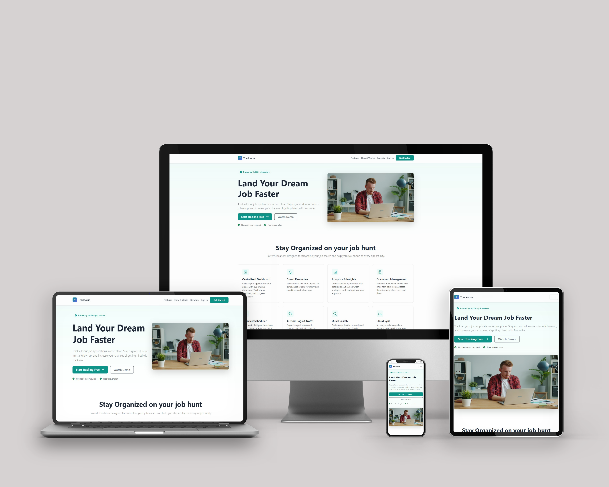

# Trackwise – Job Application Tracker

Trackwise is a full-stack web application designed to help job seekers organise, track, and manage their job applications in one place.

Job hunting often involves juggling multiple applications, interview rounds, recruiter contacts, and notes across different companies. Trackwise provides a centralised dashboard and visual tracking system that allows users to monitor the progress of their applications from submission through interviews and final outcomes.

**Live demo:** [trackwise.app](https://trackwise.app) *(update with your Heroku URL)*



---

## Table of Contents

- [Project Goals](#project-goals)
- [User Experience (UX)](#user-experience-ux)
- [Application Architecture](#application-architecture)
- [Database Design](#database-design)
- [Application Flow](#application-flow)
- [Features](#features)
- [Subscription & Payments](#subscription--payments)
- [Future Improvements](#future-improvements)
- [Technologies Used](#technologies-used)
- [Local Development Setup](#local-development-setup)
- [Environment Variables](#environment-variables)
- [Testing](#testing)
- [Deployment](#deployment)
- [Credits](#credits)

---

## Project Goals

The goal of Trackwise is to simplify the job search process by providing a structured workflow and visual overview of application progress.

The application focuses on:

- Organisation of job applications
- Clear visual tracking of application stages
- Maintaining records of interviews and recruiter contacts
- Providing a secure and personalised dashboard for each user

---

## User Experience (UX)

### User Goals

Users should be able to:

- Register and log into the application securely
- Add companies and job applications
- Track the status of each application via a drag-and-drop kanban board
- Record multiple interview rounds per application
- Store recruiter and interviewer contact details
- Maintain notes related to applications and interviews
- View all applications currently in the Interviewing stage
- See analytics and statistics about their job search activity
- Access help and FAQs from the sidebar

---

## Application Architecture

The application follows a modular Django architecture, separating authentication from the core application logic.

```
jobtracker/
│
├── jobtracker/        # Project configuration
│   ├── settings.py
│   └── urls.py
│
├── accounts/          # Authentication system
│   ├── templates/accounts/
│   │   ├── register.html
│   │   └── login.html
│   ├── models.py
│   ├── views.py
│   └── urls.py
│
├── tracker/           # Job tracking functionality
│   ├── templates/tracker/
│   ├── models.py
│   ├── views.py
│   └── urls.py
│
├── templates/
│   └── base.html
│
├── static/
│
└── manage.py
```

This architecture separates:

- Authentication logic
- Business logic
- Templates
- Static assets

---

## Database Design

The application uses a relational database structure designed around the job application lifecycle.

### Core Relationships

- A User can create multiple Companies
- A User can create multiple Applications
- A Company can have multiple Applications
- An Application can have multiple Interviews
- Contacts can be linked to both Applications and Interviews

### Entity Relationship Diagram (ERD)

```
User
 │
 ├── Company
 │     └── Application
 │            └── Interview
 │
 └── Contact
       ↑         ↑
  Application  Interview
```

### Relationships

| From | To | Type |
|---|---|---|
| User | Company | One-to-Many |
| User | Application | One-to-Many |
| Company | Application | One-to-Many |
| Application | Interview | One-to-Many |
| Application | Contact | Many-to-Many |
| Interview | Contact | Many-to-Many |

This allows recruiters or interviewers to be reused across multiple applications and interview rounds.

### Database Tables

#### User

| Key | Name | Type |
|-----|------|------|
| PK | id | Integer |
| | username | Varchar |
| | email | Varchar |
| | password | Varchar |
| | is_active | Boolean |
| | date_joined | DateTime |

#### UserProfile

Extends the built-in User model with subscription information and profile photo.

| Key | Name | Type |
|-----|------|------|
| PK | id | Integer |
| FK | user_id | Integer (User) |
| | is_premium | Boolean |
| | stripe_customer_id | Varchar (nullable) |
| | photo | CloudinaryField (nullable) |

#### Company

| Key | Name | Type |
|-----|------|------|
| PK | id | Integer |
| FK | user_id | Integer (User) |
| | name | Varchar |
| | website | Varchar |
| | location | Varchar |
| | created_at | DateTime |

#### Application

| Key | Name | Type |
|-----|------|------|
| PK | id | Integer |
| FK | user_id | Integer (User) |
| FK | company_id | Integer (Company) |
| | job_title | Varchar |
| | salary_range | Varchar |
| | status | Varchar |
| | date_applied | Date |
| | notes | Text |
| | created_at | DateTime |

#### Interview

| Key | Name | Type |
|-----|------|------|
| PK | id | Integer |
| FK | application_id | Integer (Application) |
| | interview_type | Varchar |
| | date | DateTime |
| | notes | Text |
| | result | Varchar |
| | created_at | DateTime |

#### Contact

Contacts represent external people involved in the hiring process, such as recruiters or interviewers. They are not system users and do not use Django's authentication model.

| Key | Name | Type |
|-----|------|------|
| PK | id | Integer |
| FK | user_id | Integer (User) |
| | first_name | Varchar |
| | last_name | Varchar (nullable) |
| | email | EmailField (nullable) |
| | phone | Varchar (nullable) |
| | job_title | Varchar (nullable) |
| | linkedin_url | URLField (nullable) |
| | notes | Text (nullable) |
| | created_at | DateTime |

#### Contact Relationships

| Model | Relationship |
|-------|-------------|
| Application | Many-to-Many → Contact |
| Interview | Many-to-Many → Contact |

---

## Application Flow

```
User registers
      ↓
User logs in
      ↓
User creates company
      ↓
User adds job application
      ↓
Application appears on tracker board
      ↓
User drags cards between status columns
      ↓
User records interview rounds
      ↓
User links recruiters or interviewers as contacts
```

---

## Features

### Landing Page

A public-facing marketing page introduces Trackwise to new visitors, outlines key features, and provides sign-up and login links.

### Authentication

- User registration
- Secure login and logout
- Protected views — all app pages require authentication
- Profile photo upload — users can upload a personal photo via the sidebar, stored on Cloudinary; defaults to a silhouette icon until a photo is set

### Job Tracker Board

The tracker page provides a kanban-style layout that groups applications by status. Cards can be **dragged and dropped** between columns to update their status in real time (powered by SortableJS).

Status columns include:

- Applied
- Interviewing
- Offer
- Rejected

Each application card displays:

- Job title
- Company
- Application date
- Notes
- Current status

### Interview Management

Users can track multiple interview rounds per application.

Features include:

- Add interview rounds with type, date, notes, and outcome
- Edit or delete existing rounds
- Display full interview history per application

If no interviews exist, the UI shows: *"No interview rounds yet"*

### Interview Dashboard

The Interviews page displays all applications currently in the Interviewing stage, giving a focused view of active processes.

Each card shows:

- Job title
- Company information
- Interview rounds with notes and results

### Company Management

Users can maintain a list of companies they are applying to, with full CRUD operations (create, edit, delete).

### Contacts Directory

Users can maintain a directory of recruiters and interviewers.

Contact information can include:

- Name
- Email
- Phone
- LinkedIn profile
- Job title
- Notes

Contacts can be linked to both applications and individual interview rounds, and can be reused across multiple opportunities.

### Analytics

The Analytics page gives users a data-driven overview of their job search activity.

Metrics include:

- **Total applications**, applied this week, and applied this month
- **Interview rate** — percentage of applications that reached interview stage
- **Response rate** — percentage of applications that received any response
- **Offer rate** — percentage of applications that resulted in an offer
- **Total interview rounds** logged

Charts include:

- **Applications per Month** — bar chart showing the last 6 months of activity
- **Status Breakdown** — doughnut chart showing applications grouped by current status
- **Application Funnel** — horizontal bar chart showing the drop-off from Total Applied → Got Interview → Received Offer

### Help & Support

A dedicated help page accessible from the sidebar, containing:

- **Getting Started guide** — 4-step walkthrough for new users (add company, create application, track on board, log interviews)
- **FAQ accordion** — answers to common questions covering board navigation, interview logging, contacts, subscription management, and mobile usage
- **Contact support** — direct link to the support email

---

## Subscription & Payments

Trackwise uses a **freemium model** powered by [Stripe](https://stripe.com).

- Free users have access to core tracking features
- Premium users unlock additional features
- Subscriptions are managed via Stripe Checkout
- Payments are confirmed via Stripe webhooks, which automatically update the user's account
- Premium status is displayed in the sidebar and user menu

### Payment Flow

```
User clicks "Upgrade to Premium"
      ↓
Redirected to Stripe Checkout
      ↓
Payment confirmed
      ↓
Stripe sends webhook to /stripe/webhook/
      ↓
User's account upgraded to Premium
      ↓
Redirected to payment success page
```

---

## Future Improvements

Possible future enhancements include:

- Search and filtering across applications
- Email interview reminders
- File uploads for CV versions
- Job board integrations
- Calendar integration

---

## Technologies Used

### Languages

- HTML
- CSS
- JavaScript
- Python

### Frameworks & Libraries

- Django
- Bootstrap 5
- SortableJS (drag-and-drop kanban)
- Chart.js (analytics charts)
- Stripe (payments)
- Cloudinary (profile photo storage)
- WhiteNoise (static file serving)

### Tools

- Git & GitHub
- VS Code
- Django ORM
- PostgreSQL (production)
- SQLite (local development fallback)
- Heroku (deployment)

---

## Local Development Setup

1. **Clone the repository**

   ```bash
   git clone https://github.com/your-username/job-application-tracker.git
   cd job-application-tracker
   ```

2. **Create and activate a virtual environment**

   ```bash
   python -m venv venv
   source venv/bin/activate  # Windows: venv\Scripts\activate
   ```

3. **Install dependencies**

   ```bash
   pip install -r requirements.txt
   ```

4. **Create a `.env` file** in the project root and add the required environment variables (see [Environment Variables](#environment-variables) below)

5. **Run migrations**

   ```bash
   python manage.py migrate
   ```

6. **Start the development server**

   ```bash
   python manage.py runserver
   ```

---

## Environment Variables

Create a `.env` file in the project root with the following variables:

```env
SECRET_KEY=your-django-secret-key
DEBUG=True
DATABASE_URL=your-postgres-url          # optional locally, defaults to SQLite
STRIPE_SECRET_KEY=sk_test_...
STRIPE_WEBHOOK_SECRET=whsec_...
CLOUDINARY_CLOUD_NAME=your-cloud-name
CLOUDINARY_API_KEY=your-api-key
CLOUDINARY_API_SECRET=your-api-secret
```

On Heroku, set these via the dashboard or CLI:

```bash
heroku config:set SECRET_KEY=...
heroku config:set STRIPE_SECRET_KEY=...
heroku config:set STRIPE_WEBHOOK_SECRET=...
heroku config:set CLOUDINARY_CLOUD_NAME=...
heroku config:set CLOUDINARY_API_KEY=...
heroku config:set CLOUDINARY_API_SECRET=...
```

---

## Testing

Testing includes:

- Manual functional testing
- Form validation testing
- Authentication flow testing
- CRUD operation testing
- Interview round workflow testing
- Stripe payment flow testing

Detailed testing documentation will be provided in a separate `TESTING.md` file.

---

## Deployment

The application is deployed on **Heroku**.

### Deployment Steps

1. Push project to GitHub
2. Connect GitHub repository to Heroku
3. Set all required environment variables via `heroku config:set`
4. Heroku installs dependencies from `requirements.txt` automatically
5. Run migrations: `heroku run python manage.py migrate`
6. Static files are collected automatically on deploy via `collectstatic`

---

## Credits

Resources used during development include:

- [Django Documentation](https://docs.djangoproject.com/)
- [Bootstrap Documentation](https://getbootstrap.com/docs/)
- [SortableJS](https://sortablejs.github.io/Sortable/)
- [Stripe Documentation](https://stripe.com/docs)
- StackOverflow discussions
- Various UI and UX design references
