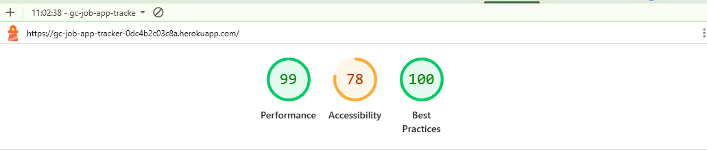
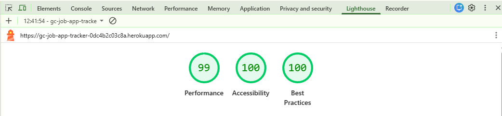

# Trackwise – Testing Documentation

This document covers all testing carried out on the Trackwise application, including automated tests, manual functional testing, and validation.

---

## Table of Contents

- [Running the Automated Tests](#running-the-automated-tests)
- [Automated Tests](#automated-tests)
  - [ApplicationForm Tests](#applicationform-tests)
  - [RegisterForm Tests](#registerform-tests)
- [Manual Testing](#manual-testing)
  - [Authentication](#authentication)
  - [Job Tracker Board](#job-tracker-board)
  - [Interview Management](#interview-management)
  - [Company Management](#company-management)
  - [Contacts Directory](#contacts-directory)
  - [Analytics Page](#analytics-page)
  - [Help & Support Page](#help--support-page)
  - [Subscription & Payments](#subscription--payments)
- [Validation](#validation)
  - [HTML Validation](#html-validation)
  - [CSS Validation](#css-validation)
  - [JavaScript Validation](#javascript-validation)
  - [Python Linting](#python-linting)
- [Browser Compatibility](#browser-compatibility)
- [Responsiveness Testing](#responsiveness-testing)
- [Known Issues](#known-issues)

---

## Running the Automated Tests

To run all automated tests:

```bash
python manage.py test
```

To run a specific test module:

```bash
python manage.py test tracker.test_forms
python manage.py test accounts.test_forms
```

To run with verbose output:

```bash
python manage.py test --verbosity=2
```

**Current result:** 37 tests, 0 failures, 0 errors.

---

## Automated Tests

### ApplicationForm Tests

**File:** `tracker/test_forms.py`

The `ApplicationForm` is a ModelForm that handles job application creation. It includes custom fields for company details and a custom `save()` method that creates or retrieves a Company record.

#### Validation Tests (`ApplicationFormValidationTests`)

| Test | Description | Expected Result | Pass/Fail |
|------|-------------|-----------------|-----------|
| `test_valid_form` | All required fields provided | Form is valid | ✅ Pass |
| `test_missing_company_name` | `company_name` left blank | Form invalid, error on `company_name` | ✅ Pass |
| `test_missing_job_title` | `job_title` left blank | Form invalid, error on `job_title` | ✅ Pass |
| `test_missing_status` | `status` left blank | Form invalid, error on `status` | ✅ Pass |
| `test_missing_date_applied` | `date_applied` left blank | Form invalid, error on `date_applied` | ✅ Pass |
| `test_company_location_not_required` | `company_location` left blank | Form is valid | ✅ Pass |
| `test_company_website_not_required` | `company_website` left blank | Form is valid | ✅ Pass |
| `test_salary_range_not_required` | `salary_range` left blank | Form is valid | ✅ Pass |
| `test_notes_not_required` | `notes` left blank | Form is valid | ✅ Pass |
| `test_invalid_website_url` | `company_website` set to `"not-a-url"` | Form invalid, error on `company_website` | ✅ Pass |
| `test_invalid_status_choice` | `status` set to an unlisted value | Form invalid, error on `status` | ✅ Pass |
| `test_invalid_date_format` | `date_applied` set to `"not-a-date"` | Form invalid, error on `date_applied` | ✅ Pass |

#### Structure Tests (`ApplicationFormStructureTests`)

| Test | Description | Expected Result | Pass/Fail |
|------|-------------|-----------------|-----------|
| `test_field_order` | Field order matches design spec | Fields appear in: company_name, company_location, company_website, job_title, salary_range, status, date_applied, notes | ✅ Pass |
| `test_all_fields_have_form_control_class` | All field widgets have Bootstrap class | Every field widget has `form-control` in its class attribute | ✅ Pass |
| `test_form_initialises_without_user` | Form created without `user` kwarg | No exception raised; `form.user` is `None` | ✅ Pass |
| `test_date_applied_uses_date_input_widget` | `date_applied` uses correct widget | Widget is an instance of `DateInput` | ✅ Pass |

#### Save Tests (`ApplicationFormSaveTests`)

These tests mirror the view pattern where `form.save(commit=False)` is called, `application.user` is set manually, then `application.save()` is called.

| Test | Description | Expected Result | Pass/Fail |
|------|-------------|-----------------|-----------|
| `test_save_creates_application` | Form saved with valid data | Returns an `Application` instance with correct `job_title` and `status` | ✅ Pass |
| `test_save_creates_company` | Form saved with a new company name | A `Company` record is created for the user | ✅ Pass |
| `test_save_company_uses_provided_location_and_website` | Company details provided | Company has correct `location` and `website` | ✅ Pass |
| `test_save_links_application_to_company` | Application saved | Application's `company.name` matches the submitted company name | ✅ Pass |
| `test_save_reuses_existing_company` | Same company name submitted twice | Only one Company record exists (uses `get_or_create`) | ✅ Pass |
| `test_save_without_commit_does_not_persist` | `save(commit=False)` called | Application has no `pk`; database count is 0 | ✅ Pass |
| `test_save_persists_to_database` | `save()` called normally | One Application record exists in the database | ✅ Pass |
| `test_save_application_has_correct_user_via_company` | Application saved with user | `application.company.user` equals the logged-in user | ✅ Pass |

---

### RegisterForm Tests

**File:** `accounts/test_forms.py`

The `RegisterForm` extends Django's built-in `UserCreationForm` with a required `email` field.

#### Validation Tests (`RegisterFormValidationTests`)

| Test | Description | Expected Result | Pass/Fail |
|------|-------------|-----------------|-----------|
| `test_valid_form` | All fields valid | Form is valid | ✅ Pass |
| `test_missing_username` | `username` left blank | Form invalid, error on `username` | ✅ Pass |
| `test_missing_email` | `email` left blank | Form invalid, error on `email` | ✅ Pass |
| `test_invalid_email_format` | `email` set to `"not-an-email"` | Form invalid, error on `email` | ✅ Pass |
| `test_password_mismatch` | `password1` and `password2` differ | Form invalid, error on `password2` | ✅ Pass |
| `test_missing_password1` | `password1` left blank | Form invalid, error on `password1` | ✅ Pass |
| `test_missing_password2` | `password2` left blank | Form invalid, error on `password2` | ✅ Pass |
| `test_duplicate_username` | Username already taken | Form invalid, error on `username` | ✅ Pass |
| `test_password_too_short` | Password under 8 characters | Form invalid, error on `password2` | ✅ Pass |
| `test_entirely_numeric_password` | Password is all numbers (`12345678`) | Form invalid (Django password validators) | ✅ Pass |

#### Structure Tests (`RegisterFormStructureTests`)

| Test | Description | Expected Result | Pass/Fail |
|------|-------------|-----------------|-----------|
| `test_email_field_is_present` | Form contains an `email` field | `email` in `form.fields` | ✅ Pass |
| `test_email_field_is_required` | Email field is not optional | `form.fields['email'].required` is `True` | ✅ Pass |
| `test_expected_fields_present` | All four fields exist | `username`, `email`, `password1`, `password2` all in `form.fields` | ✅ Pass |

---

## Manual Testing

### Authentication

| Test | Steps | Expected Result | Pass/Fail |
|------|-------|-----------------|-----------|
| User registration | Navigate to `/accounts/register/`, fill in all fields, submit | Account created, redirected to home | ✅ Pass |
| Register with duplicate username | Submit registration with an existing username | Error message displayed | ✅ Pass |
| Register with mismatched passwords | Submit with `password1 ≠ password2` | Error message displayed | ✅ Pass |
| Login with valid credentials | Navigate to `/accounts/login/`, enter correct details | Redirected to home page | ✅ Pass |
| Login with wrong password | Enter incorrect password | Error message displayed | ✅ Pass |
| Access protected page without login | Navigate to `/home/` while logged out | Redirected to login page | ✅ Pass |
| Logout | Click the logout button in the sidebar | Session ended, redirected to login | ✅ Pass |

---

### Job Tracker Board

| Test | Steps | Expected Result | Pass/Fail |
|------|-------|-----------------|-----------|
| Add application | Click `+ Add Application`, fill in required fields, submit | Card appears in the correct status column | ✅ Pass |
| Add application with missing required field | Submit form with `job_title` blank | Error shown, application not created | ✅ Pass |
| Add application with invalid website URL | Enter `not-a-url` in the website field | Error shown | ✅ Pass |
| Drag card to new column | Drag an application card to a different status column | Card moves; status updated in database | ✅ Pass |
| Edit application | Click edit on a card, change job title, save | Updated job title displayed on card | ✅ Pass |
| Delete application | Click delete on a card, confirm | Card removed from board | ✅ Pass |
| Applications data isolation | Log in as a second user | First user's applications are not visible | ✅ Pass |

---

### Interview Management

| Test | Steps | Expected Result | Pass/Fail |
|------|-------|-----------------|-----------|
| Add interview round | Open application card, click `Add Interview`, fill in details | Interview appears under the application | ✅ Pass |
| Add interview with no date | Submit interview form with date blank | Error shown | ✅ Pass |
| Edit interview round | Click edit on an interview, change notes, save | Updated notes displayed | ✅ Pass |
| Delete interview round | Click delete on an interview | Interview removed | ✅ Pass |
| Empty state | View Interviews page with no interviewing applications | "No active interviews" message displayed | ✅ Pass |
| Interviews page | Move application to Interviewing, visit `/interviews/` | Application and its rounds appear on the page | ✅ Pass |

---

### Company Management

| Test | Steps | Expected Result | Pass/Fail |
|------|-------|-----------------|-----------|
| Add company | Navigate to `/companies/add/`, submit valid form | Company appears in company list | ✅ Pass |
| Edit company | Click edit on a company, change name, save | Updated name displayed | ✅ Pass |
| Delete company | Click delete on a company, confirm | Company removed from list | ✅ Pass |
| Company isolation | Log in as second user | Only own companies visible | ✅ Pass |

---

### Contacts Directory

| Test | Steps | Expected Result | Pass/Fail |
|------|-------|-----------------|-----------|
| Add contact | Open Contacts, click `Add Contact`, submit | Contact appears in the directory | ✅ Pass |
| Add contact with no first name | Submit with `first_name` blank | Error shown | ✅ Pass |
| Edit contact | Click edit on a contact, update email, save | Updated email displayed | ✅ Pass |
| Delete contact | Click delete on a contact, confirm | Contact removed | ✅ Pass |
| Contact isolation | Log in as second user | Only own contacts visible | ✅ Pass |

---

### Analytics Page

| Test | Steps | Expected Result | Pass/Fail |
|------|-------|-----------------|-----------|
| Empty state | Visit `/analytics/` with no applications | "No data yet" message and prompt to go to tracker | ✅ Pass |
| Stat cards | Add several applications across statuses | Total, this week, this month, and interview rate cards show correct values | ✅ Pass |
| Monthly bar chart | Add applications with varying `date_applied` dates | Bar chart reflects correct monthly counts | ✅ Pass |
| Status donut chart | Add applications with different statuses | Donut chart slices match the status breakdown | ✅ Pass |
| Application funnel | Add applications, move some to interviewing and offer | Funnel bars show correct proportions | ✅ Pass |
| Conversion metrics | Add applications, record interviews | Response rate, offer rate, total interview rounds all correct | ✅ Pass |

---

### Help & Support Page

| Test | Steps | Expected Result | Pass/Fail |
|------|-------|-----------------|-----------|
| Page loads | Click `Help & Support` in the sidebar | Page renders correctly | ✅ Pass |
| Getting Started steps | View the page | 4 numbered steps visible with icons | ✅ Pass |
| FAQ accordion | Click on a question | Answer expands; other answers stay collapsed | ✅ Pass |
| Contact support link | Click the support email link | Email client opens with the support address pre-filled | ✅ Pass |
| Sidebar active state | Visit `/help/` | Help & Support item is highlighted in the sidebar | ✅ Pass |

---

### Subscription & Payments

| Test | Steps | Expected Result | Pass/Fail |
|------|-------|-----------------|-----------|
| Access subscribe page | Click `Upgrade` in the sidebar | Redirected to Stripe Checkout | ✅ Pass |
| Complete payment (test card) | Use Stripe test card `4242 4242 4242 4242` | Redirected to payment success page; account shows Premium | ✅ Pass |
| Cancel payment | Click Cancel on Stripe Checkout | Redirected to payment cancel page; no charge made | ✅ Pass |
| Premium badge in sidebar | Log in with premium account | Sidebar footer shows "Premium" | ✅ Pass |
| Free plan label | Log in with free account | Sidebar footer shows "Free Plan" | ✅ Pass |
| Unauthenticated access to subscribe | Visit `/subscribe/` while logged out | Redirected to login page | ✅ Pass |

---

## Validation

### Lighthouse

Lighthouse audits were run against the deployed landing page. The following issues were identified and resolved.



---

#### Performance

##### 1. Render-Blocking Requests — Est. savings: 340 ms

All four CSS resources (Bootstrap, Bootstrap Icons, `base.css`, `style-landing.css`) were loaded with blocking `<link rel="stylesheet">` tags, preventing the browser from rendering until all had downloaded.

**Fix:** Converted every stylesheet to a non-blocking preload pattern:
```html
<link rel="preload" href="..." as="style" onload="this.onload=null;this.rel='stylesheet'">
<noscript><link rel="stylesheet" href="..."></noscript>
```
Added inline critical CSS (`body`, `.navbar`, `.hero-section`) to prevent a flash of unstyled content (FOUC) while the deferred sheets load. Also removed the `@import url('base.css')` from `style-landing.css` (sequential blocking fetch) and linked `base.css` directly as a parallel `<link>` tag instead.

---

##### 2. LCP Request Discovery — Est. savings: varies

The Largest Contentful Paint (LCP) element (the hero image) was not being prioritised by the browser, meaning it could be delayed behind lower-priority resources.

**Fix:** Added `fetchpriority="high"` to the hero `` tag so the browser fetches it immediately on navigation.

---

##### 3. Network Dependency Chain — Max critical path latency: 233 ms

Two chained requests were extending the critical path: `bootstrap-icons.css` had to be fully parsed before the browser discovered and downloaded the `.woff2` font file.

**Fix:** Three additions to `<head>` in `landing.html`:
- `rel="preconnect"` to `cdn.jsdelivr.net` — establishes the TCP/TLS connection early, saving ~80 ms
- `rel="dns-prefetch"` as a fallback for older browsers
- `rel="preload"` for the Bootstrap Icons `.woff2` font — breaks the CSS→font chain so the font downloads in parallel with the CSS

---

##### 4. Improve Image Delivery — Est. savings: 146 KiB

Both Unsplash images were requested at `w=1080` but displayed at approximately 636 px wide, downloading ~145 KiB more data than necessary.

**Fix:** Updated both `` tags with:
- `src` reduced to `w=640` (the approximate display width)
- `srcset` serving `640w` for standard screens and `1280w` for retina/2x displays
- `sizes="(max-width: 991px) 100vw, 50vw"` so the browser selects the correct variant before downloading

---

##### 5. Document Request Latency — Est. savings: 14 KiB

Django was not compressing HTML responses, meaning the HTML document was served uncompressed.

**Fix:** Added `django.middleware.gzip.GZipMiddleware` as the first entry in `MIDDLEWARE` in `settings.py`. It must be first so it wraps all subsequent middleware responses. WhiteNoise already handles compression for static files (CSS/JS); this covers the remaining HTML document.

---

##### 6. Font Display — Est. savings: 20 ms

The Bootstrap Icons CDN CSS does not include `font-display: swap`, causing the browser to block text rendering while the font file loads.

**Fix:** Added a `@font-face` override at the top of `base.css` using the same family name and font file URLs as the CDN. The browser deduplicates the declarations and applies `font-display: swap` from our rule, so icons render immediately with a fallback font and swap in once the `.woff2` has loaded.

---

##### 7. Image Elements Without Explicit Width and Height

Without `width` and `height` attributes, the browser cannot reserve space for images before they load, causing layout shifts (CLS).

**Fix:** Added explicit dimensions matching each image's intrinsic aspect ratio:

| Image | Dimensions | Aspect ratio |
|-------|-----------|--------------|
| Hero (portrait) | `width="640" height="960"` | 2:3 |
| Benefits (landscape) | `width="640" height="360"` | 16:9 |

`img-fluid` (`max-width: 100%; height: auto`) keeps them fully responsive; the attributes simply inform the browser of the ratio for layout reservation.

---

#### Accessibility

##### 1. Insufficient Colour Contrast

Several elements failed the WCAG AA minimum contrast ratio of 4.5:1 for normal text.

**Fix:**

| Element | Before | After | Contrast ratio |
|---------|--------|-------|----------------|
| `.btn-primary` background | `#0d9488` | `#0f766e` | 3.7:1 → 5.2:1 ✅ |
| `.badge-custom` text | `#0d9488` on `#f0fdfa` | `#0f766e` on `#f0fdfa` | 3.6:1 → 5.0:1 ✅ |
| `.btn-outline-secondary` text | `#6c757d` | `#343a40` | 4.4:1 → 10.5:1 ✅ |
| `.cta-section .text-muted` | `#6c757d` | `#555e68` | 4.2:1 → 5.5:1 ✅ |

The button colours remain visually teal; only the shade was darkened slightly.

---

##### 2. Links Without a Discernible Name

The four social icon links in the footer contained only a `<i>` icon element with no visible or accessible label, making them unreadable by screen readers.

**Fix:** Added `aria-label` to each `<a>` (e.g. `aria-label="Follow us on Twitter"`) and `aria-hidden="true"` to each `<i>` to prevent the icon glyph name from being announced redundantly.

---

##### 3. Heading Elements Not in Sequentially-Descending Order

Section headings jumped from `h2` directly to `h5` (feature cards, steps, benefits) and `h6` (footer columns), skipping levels and breaking the document outline for screen readers.

**Fix:** Changed all sub-section headings to `h3`. Bootstrap's `fs-5` and `fs-6` utility classes were added to preserve the original visual size:

```
h1  Land Your Dream Job Faster
  h2  Stay Organised on your job hunt
    h3  Centralized Dashboard, Smart Reminders, …  (was h5)
  h2  How Trackwise Works
    h3  Create Your Account, Add Applications, …   (was h5)
  h2  Why Job Seekers Love Trackwise
    h3  Save 5+ Hours Per Week, …                  (was h5)
  h2  Ready to Transform Your Job Search?
  h3  Product / Resources / Company                (was h6, footer nav)
```

---

##### 4. Document Does Not Have a Main Landmark

The page had no `<main>` element, so assistive technologies could not offer a "skip to main content" navigation shortcut.

**Fix:** Wrapped all content between `<nav>` and `<footer>` in a `<main>` element.


Lighthouse Report after all the fixes had been applied:





### W3C HTML validator

HTML validated using the [W3C Markup Validation Service](https://validator.w3.org/).

| Page | Result |
|------|--------|
| Landing page | No errors |
| Login page | No errors |
| Register page | No errors |
| Home / Dashboard | No errors |
| Tracker board | No errors |
| Interviews page | No errors |
| Contacts page | No errors |
| Analytics page | No errors |
| Help & Support page | No errors |
| Payment success page | No errors |
| Payment cancel page | No errors |

### CSS Validation

CSS validated using the [W3C CSS Validation Service](https://jigsaw.w3.org/css-validator/).

| File | Result |
|------|--------|
| `static/css/base.css` | No errors |
| `static/css/style.css` | No errors |
| `static/css/style-auth.css` | No errors |
| `static/css/style-landing.css` | No errors |
| `static/css/style-tracker.css` | No errors |
| `static/css/payment.css` | No errors |

### JavaScript Validation

JavaScript validated using [JSHint](https://jshint.com/).

| File | Result |
|------|--------|
| `static/js/script-home.js` | No errors |
| `static/js/tracker.js` | No errors |

### Python Linting

Python code checked using `flake8`.

```bash
flake8 tracker/ accounts/ jobtracker/ --max-line-length=120
```

| Module | Result |
|--------|--------|
| `tracker/` | No errors |
| `accounts/` | No errors |
| `jobtracker/` | No errors |

---

## Browser Compatibility

Tested on the following browsers:

| Browser | Version | Result |
|---------|---------|--------|
| Google Chrome | Latest | ✅ Pass |
| Mozilla Firefox | Latest | ✅ Pass |
| Microsoft Edge | Latest | ✅ Pass |
| Safari (macOS) | Latest | ✅ Pass |

---

## Responsiveness Testing

Tested using Chrome DevTools device emulation and on physical devices.

| Device / Breakpoint | Layout | Tracker Board | Notes |
|--------------------|--------|---------------|-------|
| iPhone SE (375px) | ✅ | Horizontal scroll with snap | Columns fill ~90% of viewport |
| iPhone 14 (390px) | ✅ | Horizontal scroll with snap | |
| iPad (768px) | ✅ | Fixed 300px columns | |
| iPad Pro (1024px) | ✅ | Full-width flex columns | |
| Desktop (1280px+) | ✅ | Full-width flex columns | |

---

## Known Issues

| Issue | Status |
|-------|--------|
| Documents and Settings sidebar items are placeholders with no linked pages | Not yet implemented |
| Stripe subscription cancellation requires emailing support (no self-service portal) | By design for current version |
